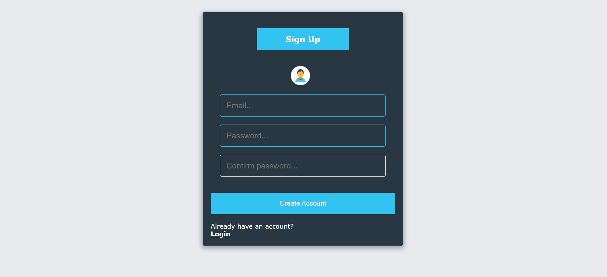
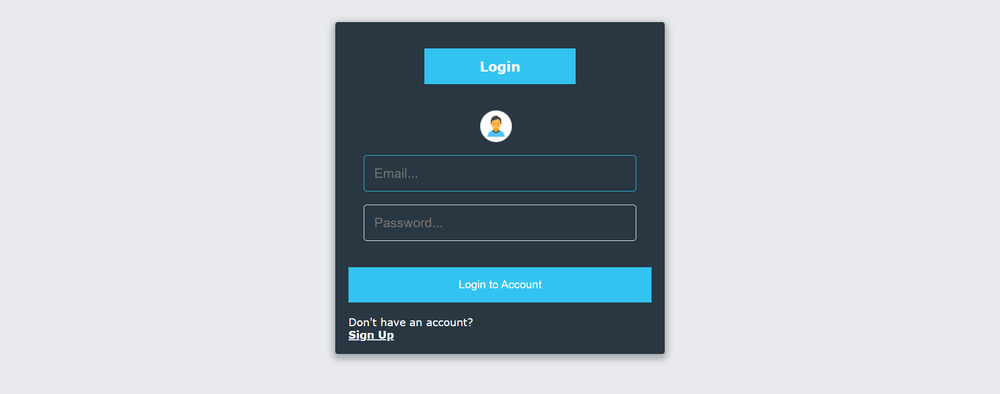
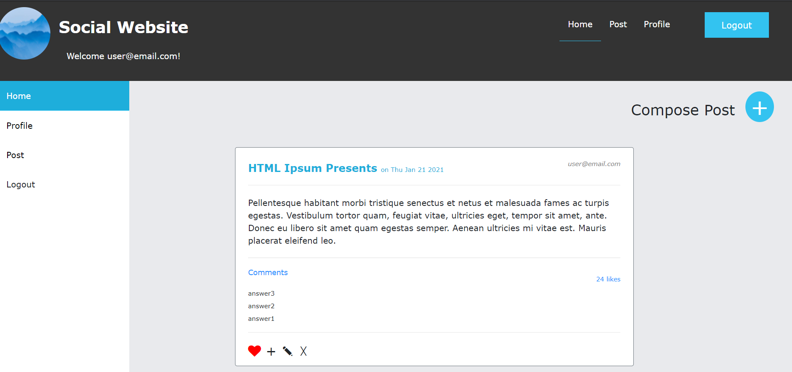
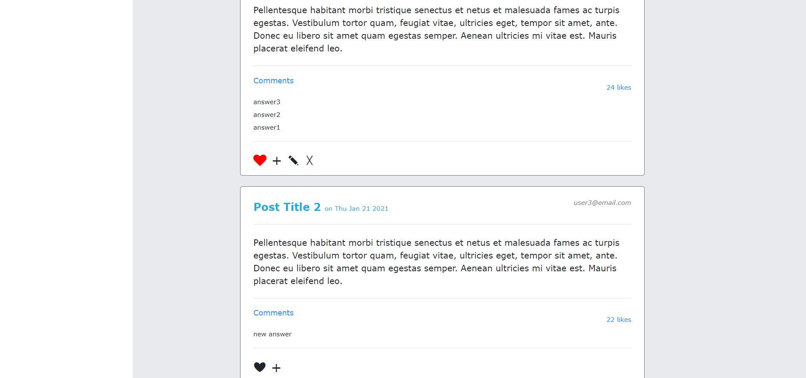
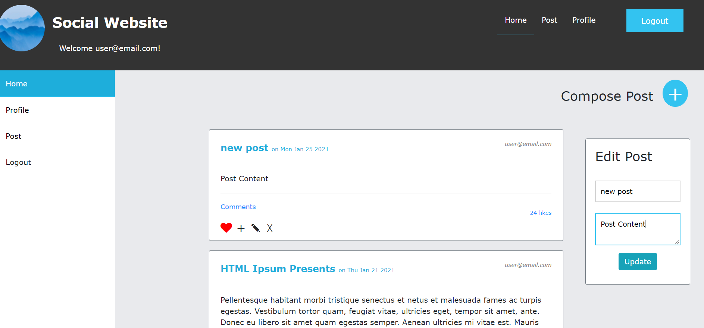
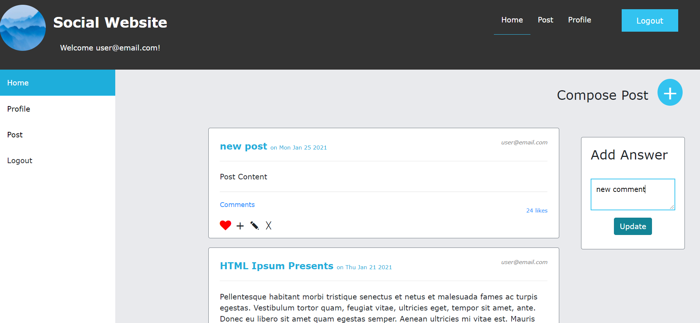
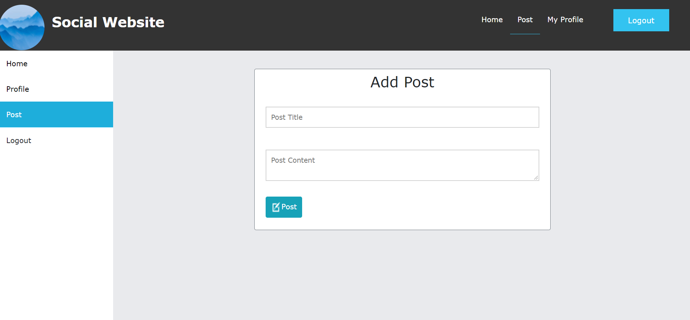
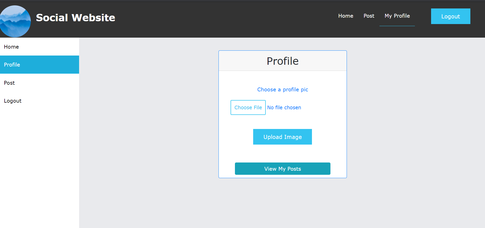

# Student-community-website
JavaScript, Firebase, HTML, CSS. It is a social profile website that includes authentication, profiles, viewing trending posts, adding posts, uploading profile pictures, liking posts and adding comments on posts. User can edit and delete posts created by them.

# Sign Up

# Login

# View Trending Posts

# Like Posts

# Edit Post

# Add Comments

# Add a new Post

# Add/Change your Profile Picture and View all your Posts

